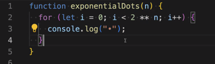

## Key Lecture Take Away Points
* Polynomials are used in software development to gage **runtime** or memory usage of a specific algorithm. 
    * Not all expressions are polynomials:
        * 2n can not be a polynomial since the variable is in the exponent.
        * 1/n or n-1 which results in a negative exponent.
    * Most realistic evaluation is the time to complete an algorithm with loops and nested loops.
    * When looking at the graph of a polynomial, the x and y axis are mapping the input (users, space, etc.) and the output (steps, total time, memory usage, etc.)

Example of an algorithm for exponential growth:

